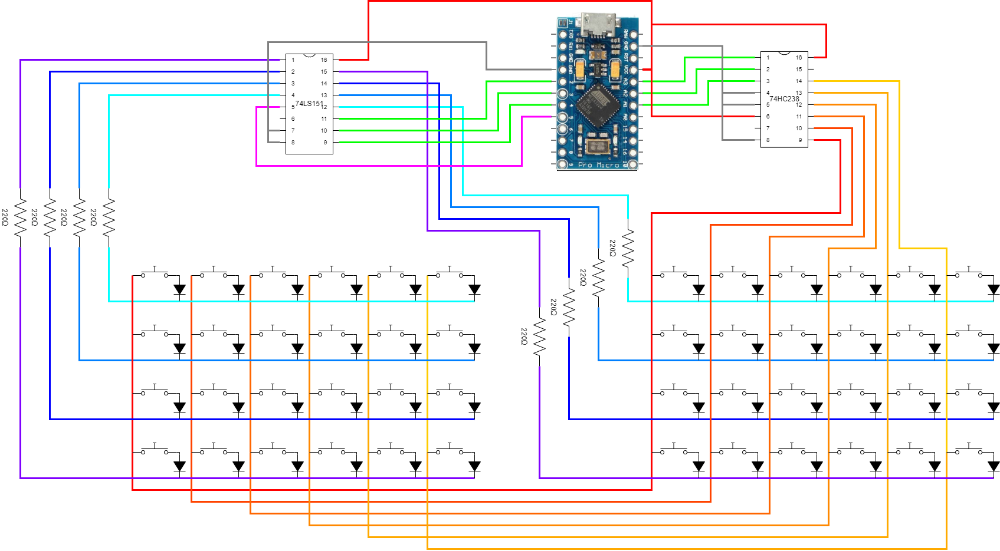
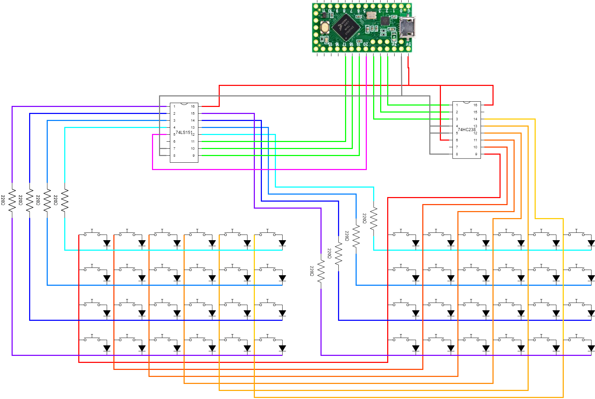

# Teclado Arduino
Thanks to the chips 
 - 3 to 8 LINE DECODER [74HC238](documentation/datasheet-DECO-M74HC238_STMicroelectronics.pdf)
 - 8 to 3 LINE MULTIPLEXOR [74LS151](documentation/datasheet-MUX-74LS151.pdf)

 we are able to read up to 64 inputs with only 6+1 pins of the microcontroller

## Arduino pro micro

## TEENSY LC
