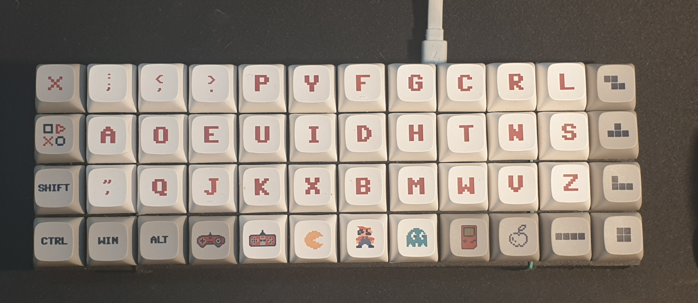
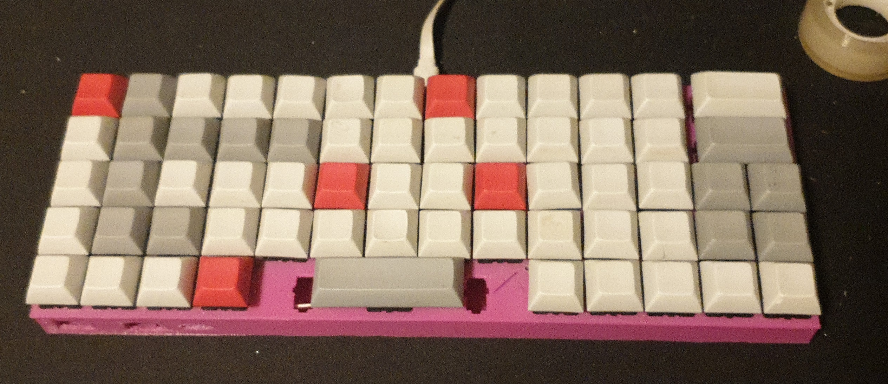

# Arduino Keyboard

- [Keyboard customization](keyboards/README.md)
- [How Keyboard hardware basic](playground/inputMatrix/README.md)
- [How Keyboard hardware DECO-MUX](playground/deco-mux/README.md)
- [Keyboard code examples](playground/README.md)

# Keyboards I've build

## Keyboard 48
more about [here](keyboard48/README.md)

## Keyboard 64
more about [here](keyboard64/README.md)

All the documentation has been written by its own keyboard