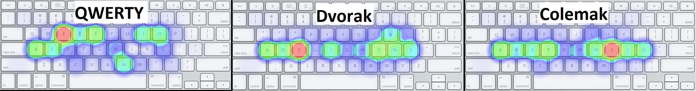
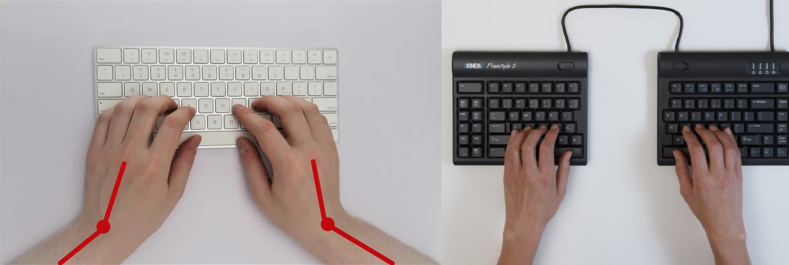

# KEYBOARD PARAMETERS

Keyboards are a very deep world, there are infinite combinations to make a keyboard, as you can customize everything

Here i will explain some of the more usually customizations but take in mind that EVERYTHING is possible

you can add encoders, screens, joysticks, lazers, eye-tracking, voice-recognition, neuralink... whatever you can imagine

## KEYBOARD DISTRIBUTION
The keyboard distribution its the arrangement of the keys on the keyboard, the more usual its QWERTY since it got fame in the 1880's with the introduction of the typewriters in the offices.

**Qwerty** was made for typewriters to not get jammed, actually, some people think that was designed specially to slow you down, to give the typewriter time to retract. It was designed in 1868, and the first personal computers where released in the mid 70's, so there couldn't be a specific product.

100 years later, in the 1936  **DVORAK** was invented, to focus all the mainly used keys in the middle row, to minimize the finger travel distance. And then in the 2006 **COLEMAK** was invented with the same idea

There are lots of keyboard distributions now, even you can create your own if you want, for example dvorak has some for left handed, or right handed, one specially for programmers etc.

As you can see, both **Dvorak** and **Colemak**, they center the focus in the middle row, while **Qwerty** its a bit more chaotic.

## ORTHOLINEAR vs. STAGGERED
Also a design key of **Qwerty** was staggered keys, because the typewriters couldn't algin the keys for the mechanical arms bellow it.

Most of the people has get use to it, for the left hand its not an uncomfortable position, but its not symmetric, the right hand also has the keys tilted to the left.

Then appeared the **Ortholinear** keyboards that offer a straight grid for the keys but if you see, not all the fingers have the same length, for that reason the ortholinear has made an evolution to **Ortholinear ergonomic** that they usually are split keyboards. due to the small size ortholinears tend to became, you will end typing with your hands so close and uncomfortable angle. 

## SLPIT KEYBOARD
They are an ergonomic solution to the problem that generates writing left and right keys so close while your arms are naturally separated. They can be just separated zones in one single device, or two devices that connect to each other.

## KEYBOARD 100% 75% 65% 60% 40%
The theory its clear, as bigger the keyboard, more distance your hands will have to travel to reach every key, but what happen to all removed keys?
The keys are not removed, they are simply hidden by a layer. Like a phone keyboard that you press a key to access the numbers and symbols, here is the same, you usually have 1 or 2 FN keys to access the hidden layers.

**What does the percentage mean?**
A 100% keyboard or **Full-sized**, usually they have between 104 and 108 keys, so a 100% keyboard its a 100 ish keyboard, so 75% means 75 ish keys and so one...
- **100%** or FULL-SIZE: 
    - the regular keyboard, comfortable but bulky. for number entry its more useful and fast to have a numpad.
- **96%** or 1800 compact: 
    - this format its lost, its super rare to find one. Here you will lose the middle keys (Supr, Home, End, AvPag, RePag, ImpPant...)
- **87%** or Ten Key Less (TKL): 
    - Reducing the numpad you will get more space for the mouse, also you have the number row on the top, so the numpad its redundant.
- **75%**:
    - As 87% you will lose the numpad, but this tim the middle column will get squished to the main block and you may lose a few keys
- **65%**:
    - Its a 75% keyboard without F1...F12 keys basically
- **60%**:
    - Here you will lose the arrows and the remaining keys of the middle column, to access them you will need to use layers
- **40%**:
    - This is getting small, now you will lose the number row, now gaming tasks they may get compromised.
- **30%**:
    - This is as small as you can go, the Latin alphabet usually has 26 letters, so you will get 4 more keys to change between layers.

Of course there are a lot of keyboards and everyone its different and there may be 37% or 72% or strange numbers, there are infinite combinations.

# Keyboards I've build

## Keyboard 48
more about [here](keyboard48/README.md)

## Keyboard 64
more about [here](keyboard64/README.md)
