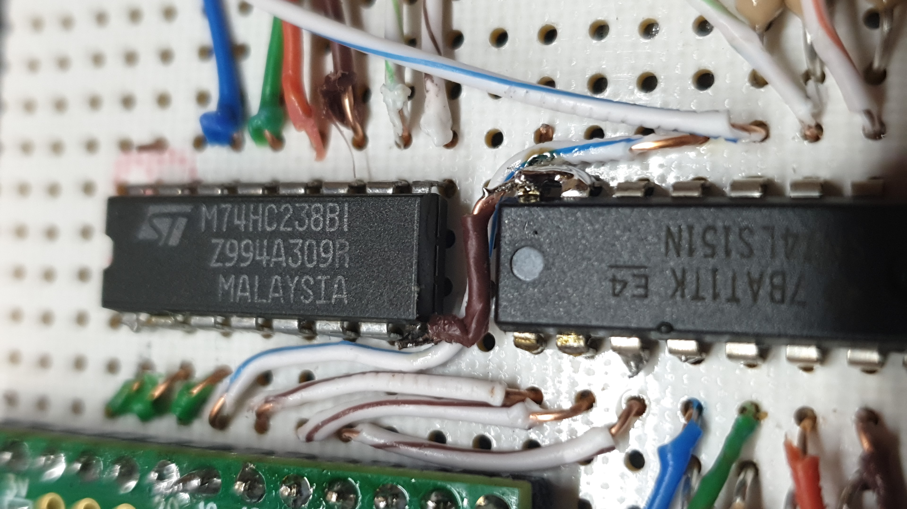
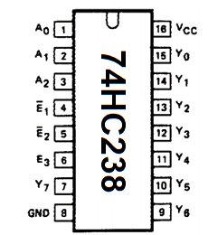
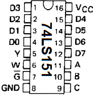

# DECODER & MULTIPLEXOR

### CODE EXAMPLES
  - [deco-mux.ino](deco-mux/deco-mux.ino) explains how a **Multiplexer** and a **Decoder** works
  - [deco-mux-matrix.ino](deco-mux-matrix/deco-mux-matrix.ino) explains how to read a button matrix with a **Multiplexer** and a **Decoder**
## Decoder
 - see on [wikipedia](https://wikipedia.org/wiki/Decodificador)  
 - [74HC238 datasheet](../../documentation/datasheet-DECO-M74HC238_STMicroelectronics.pdf)  

 - **(A0,A1,A2)**-> microcontroller selector
 - **(Y0,Y1...Y6,Y7)**-> Decoder outputs
 - **(!E1,!E2,E3)** -> bring the option to connect 4 of them to create an **ULTRA-DECODER**
    - **!E1** and **!E2** set to ground (for normal operation)
    - **E3** set to 5V (for normal operation)
 - **VCC & GND** -> 🙃

A decoder has **n** inputs and **2n** outputs  
And what it does its to triger only the output that matches the input binary convination

for the **74HC238** that i'm using on the project the output table is the next:

| A | B | C || Y0 | Y1 | Y2 | Y3 | Y4 | Y5 | Y6 | Y7 |
|---|---|---|-|----|----|----|----|----|----|----|----|
0|0|0| |1|0|0|0|0|0|0|0|
0|0|1| |0|1|0|0|0|0|0|0|
0|1|0| |0|0|1|0|0|0|0|0|
0|1|1| |0|0|0|1|0|0|0|0|
1|0|0| |0|0|0|0|1|0|0|0|
1|0|1| |0|0|0|0|0|1|0|0|
1|1|0| |0|0|0|0|0|0|1|0|
1|1|1| |0|0|0|0|0|0|0|1|

see it on action  

## Multiplexor
 A multiplexor its basicaly an imput selector
 it has **n** chanel selectors, **2n** inputs and 1 output  
 with the microcontroller you can select any input by setting the channel selectors **HIGH** or **LOW**  
 then it will set its output to the value of the selected input

 - see on [wikipedia](wikipedia.org/wiki/Multiplexor)
 - [74LS151 datasheet](../../documentation/datasheet-MUX-74LS151.pdf)

 - **(A,B,C)**-> microcontroller channel selector
 - **(D0,D1..D6,D7)** -> Multipexor inputs
 - **(Y,W)** 
    - **Y** -> output
    - **W** -> negated output
 - **G** -> set to ground for formal operation

 | C|B|A|| Y | W |
|---|---|-|--|----|-|
0|0|0| |D0|!D0|
0|0|1| |D1|!D1|
0|1|0| |D2|!D2|
0|1|1| |D3|!D3|
1|0|0| |D4|!D4|
1|0|1| |D5|!D5|
1|1|0| |D6|!D6|
1|1|1| |D7|!D7|

## COMBINATION DECO & MUX
read first how [input matrix](../inputMatrix/README.md) works