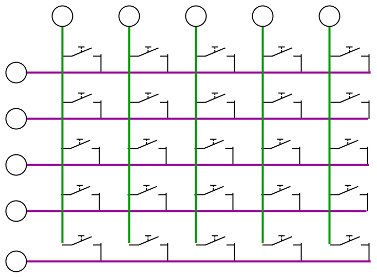
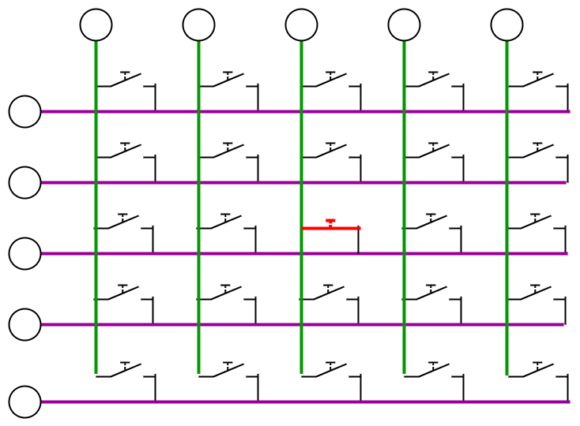
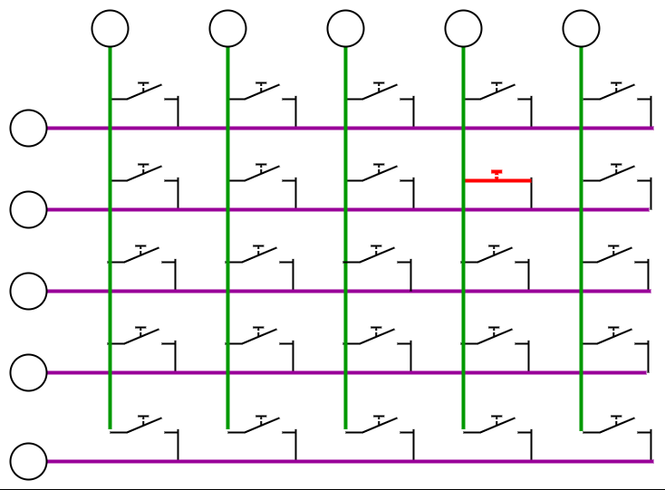
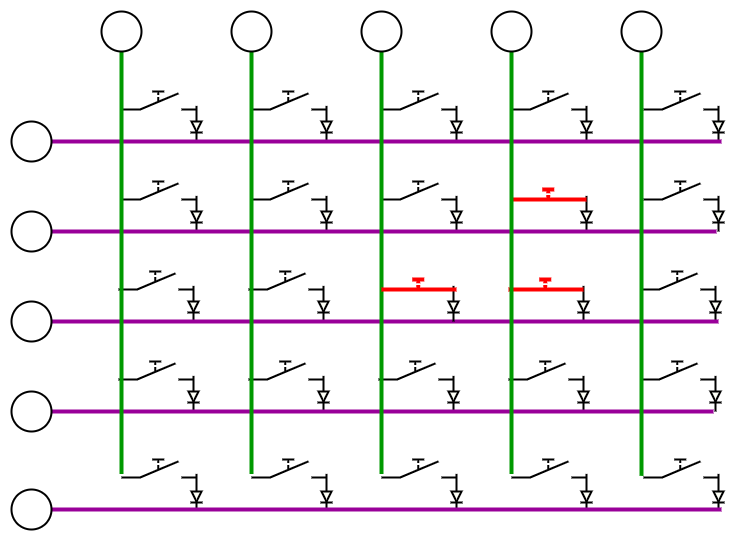

# INPUT MATRIX
When making a keyboard with a microcontroller the first question its,  
how am I suposed to read 64+ inputs with a board that has less than 20 gpio  

the answer to that its **INPUT MATRIX**

for the cost of **N+M** gpio you will be able to read **N*M** inputs

|N+M|N*M|ratio inputs/GPIO|a|
|-|-|-|-|
|1+1 = **2** |1*1 = **1** | **0.5**  STUPID
|2+2 = **4** |2*2 = **4** | **1**    USELESS
|3+3 = **6** |3*3 = **9** | **1.5**  BAD
|4+4 = **8** |4*4 = **16**| **2**    NOT BAD
|5+5 = **10**|5*5 = **25**| **2.5**  BETTER
|4+6 = **10**|4*6 = **24**| **2.4**  WORSE
|3+7 = **10**|3*7 = **21**| **2.1**  WORSER

as you see, it wrows exponencialy the ratio  
but as the diference of **N** and **M** gets bigger, the ratio also goes down
so we want to keep M and N as close as we can

## HOW IT WORKS
the DECODER sets each column, one at a time, and if a button is pressed the row will activate
and then the multiplexer will scan each row, if it detects the row activatet, it will know row and column,
then it could decode which key it is

## MULTIPLE PRESS
following the same process its able to detect multiple key presses at the same time

## MULTIPLE PRESS GHOSTING
BUT if we press the buttons in a certan way there will appear ghost key presses
the electricitty will loop for the pressed buttons and activate rows that shouldnt be activated,

## GHOSTIN SOLUTION
to resolve the ghostin solution we will put diodes afte each button, that way the electricity will exti any button but it will not enter to any button, preventing it from circulating wherever it wants

